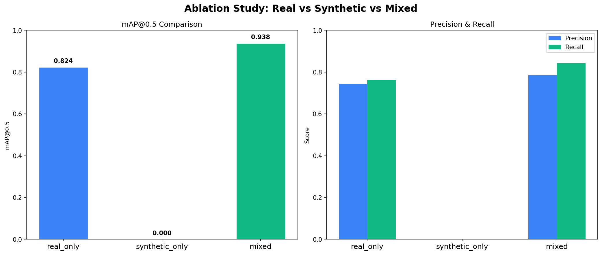
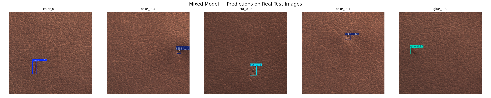

# Synthetic Data Generation for Industrial Defect Detection


## Problem
Industrial defect detection models need thousands of labeled images to train effectively. But real factories have very few defect images — defects are rare by definition. This project solves that data scarcity problem using generative AI.

## Solution
1. Collect small set of real defect images (92 images, MVTec AD dataset)
2. Fine-tune Stable Diffusion 1.5 using LoRA on those images
3. Generate 500 synthetic defect images
4. Train YOLOv8 on real-only, synthetic-only, and mixed datasets
5. Prove synthetic augmentation improves real-world detection accuracy

---

## Results

### Ablation Study

| Training Data | mAP@0.5 | Precision | Recall | vs Baseline |
|:---|:---:|:---:|:---:|:---:|
| Real only (baseline) | 0.824 | 0.746 | 0.763 | — |
| Synthetic only | 0.000 | 0.000 | 0.000 | -100% |
| **Mixed (real + synthetic)** | **0.938** | **0.786** | **0.842** | **+13.8%** |

### Per-class Results (Mixed Model)

| Defect Class | Precision | Recall | mAP@0.5 |
|:---|:---:|:---:|:---:|
| Color | 1.000 | 0.609 | 0.972 |
| Cut | 0.774 | 0.800 | 0.783 |
| Fold | 0.447 | 1.000 | 0.995 |
| Glue | 0.720 | 1.000 | 0.995 |
| Poke | 0.990 | 0.800 | 0.962 |
| **Overall** | **0.786** | **0.842** | **0.938** |

### Training Details

| Experiment | Dataset Size | Epochs | Early Stop | mAP@0.5 |
|:---|:---:|:---:|:---:|:---:|
| real_only | 73 train / 19 val | 39 | Yes (ep 19) | 0.824 |
| synthetic_only | 240 train / 61 val | 20 | Yes | 0.000 |
| mixed | 313 train / 19 val | 64 | Yes (ep 44) | 0.938 |

### Key Finding
> Synthetic-only training failed completely (domain gap). Mixing real + synthetic improved mAP by **+13.8%** — proving generative AI augmentation works for industrial defect detection.

### Ablation Chart


### Sample Predictions (Mixed Model on Real Test Images)


---

## Pipeline
Real defect images (92 images, 5 defect classes)

↓

SD 1.5 + LoRA fine-tuning on Kaggle T4 GPU

↓

500 synthetic defect images generated locally

↓

3-way ablation study (real_only / synthetic_only / mixed)

↓

YOLOv8n trained on each split (100 epochs)

↓

Evaluated on real test images → mAP@0.5

↓

Deployed as Gradio web application

---

## Dataset

**MVTec Anomaly Detection Dataset — Leather category**

| Split | Category | Count |
|:---|:---|:---:|
| Train | Good (normal) | 245 |
| Test | Color defect | 19 |
| Test | Cut defect | 19 |
| Test | Fold defect | 17 |
| Test | Glue defect | 19 |
| Test | Poke defect | 18 |
| **Total** | **Real defect images** | **92** |

After synthetic generation: **592 total images (92 real + 500 synthetic)**

Dataset available via Git LFS in this repo or download from:
https://www.mvtec.com/company/research/datasets/mvtec-ad

---

## Tech Stack

| Component | Tool |
|:---|:---|
| Generative model | Stable Diffusion 1.5 |
| LoRA fine-tuning | Hugging Face diffusers + PEFT |
| Object detection | YOLOv8n (Ultralytics) |
| Deep learning | PyTorch 2.5.1 + CUDA |
| Web app | Gradio |
| Training compute | Kaggle T4 (LoRA), RTX 3050 (YOLOv8) |

---

## Project Structure


Synthetic-Data-Generation-for-Defect-Detection/

│

├── app.py                          # Gradio web application

├── requirements.txt                # Python dependencies

├── real_only.yaml                  # YOLOv8 config — real images only

├── synthetic_only.yaml             # YOLOv8 config — synthetic only

├── mixed.yaml                      # YOLOv8 config — real + synthetic

│

├── scripts/

│   ├── prepare_lora_data.py        # Resize and organize images for LoRA training

│   ├── generate_synthetic.py       # Generate synthetic images using trained LoRA

│   ├── create_yolo_labels.py       # Convert MVTec masks to YOLO bounding boxes

│   ├── label_synthetic.py          # Create center-box labels for synthetic images

│   ├── build_datasets.py           # Build real_only / synthetic_only / mixed splits

│   ├── evaluate_all.py             # Run validation on all 3 trained models

│   ├── plot_results.py             # Plot ablation comparison charts

│   └── visualise_predictions.py    # Visualize bounding box predictions

│

├── notebooks/

│   └── 01_explore_mvtec.ipynb      # EDA — defect types, image stats, visualization

│

├── models/

│   └── lora_output/                # Trained LoRA adapter weights

│       ├── adapter_config.json     # LoRA configuration (r=16, alpha=32)

│       └── adapter_model.safetensors  # Fine-tuned weights (6.1MB, tracked via LFS)

│

├── results/

│   ├── comparison.csv              # Numerical results table

│   ├── ablation_comparison.png     # Bar chart — mAP, Precision, Recall

│   ├── defect_overview.png         # Visual overview of all 5 defect types

│   └── sample_predictions.png      # Sample detections on real test images

│

└── data/                           # Tracked via Git LFS

├── mvtec/leather/              # Raw MVTec dataset

├── real/                       # Processed real defect images + YOLO labels

└── synthetic/                  # Generated synthetic images + labels

---

## How to Run

### Option 1 — Clone with dataset included (via Git LFS)

```bash
# Install Git LFS first
git lfs install

# Clone repo (dataset downloads automatically via LFS)
git clone https://github.com/saurabhghadage59/Synthetic-Data-Generation-for-Defect-Detection
cd Synthetic-Data-Generation-for-Defect-Detection

# Install dependencies
pip install -r requirements.txt

# Run the app
python app.py
```

Open `http://localhost:7860` in your browser. Upload any leather surface image to detect defects.

---

### Option 2 — Clone without LFS (manual dataset download)

```bash
# Clone without large files
GIT_LFS_SKIP_SMUDGE=1 git clone https://github.com/saurabhghadage59/Synthetic-Data-Generation-for-Defect-Detection
cd Synthetic-Data-Generation-for-Defect-Detection

# Install dependencies
pip install -r requirements.txt
```

Download the leather category from MVTec:https://www.mvtec.com/company/research/datasets/mvtec-ad

Extract to `data/mvtec/leather/`

```bash
python app.py
```

---

### Option 3 — Run the full pipeline from scratch

**Step 1 — Prepare LoRA training data**
```bash
python scripts/prepare_lora_data.py
```

**Step 2 — Fine-tune LoRA on Kaggle T4 GPU**

Upload `data/lora_training/` folder to Kaggle as a dataset.
Run the LoRA training notebook on Kaggle (T4 GPU, free tier).
Download `adapter_model.safetensors` and save to `models/lora_output/`

**Step 3 — Generate synthetic images locally**
```bash
python scripts/generate_synthetic.py
```

**Step 4 — Create YOLO labels**
```bash
python scripts/create_yolo_labels.py
python scripts/label_synthetic.py
```

**Step 5 — Build dataset splits**
```bash
python scripts/build_datasets.py
```

**Step 6 — Train YOLOv8 (3 experiments)**
```bash
yolo train data=real_only.yaml model=yolov8n.pt epochs=100 imgsz=640 batch=4 name=exp1_real_only project=results patience=20 device=0
yolo train data=synthetic_only.yaml model=yolov8n.pt epochs=100 imgsz=640 batch=4 name=exp2_synthetic_only project=results patience=20 device=0
yolo train data=mixed.yaml model=yolov8n.pt epochs=100 imgsz=640 batch=4 name=exp3_mixed project=results patience=20 device=0
```

**Step 7 — Evaluate and plot results**
```bash
python scripts/evaluate_all.py
python scripts/plot_results.py
```

**Step 8 — Run the app**
```bash
python app.py
```

---

### Hardware Requirements

| Task | Minimum | Used in this project |
|:---|:---|:---|
| LoRA fine-tuning | 8GB VRAM | Kaggle T4 16GB (free) |
| Synthetic generation | 4GB VRAM | RTX 3050 4GB |
| YOLOv8 training | 4GB VRAM | RTX 3050 4GB |
| Running the app | CPU only | Any machine |

---

## Author

**Saurabh** | M.Tech Data Science
GitHub: [@saurabhghadage59](https://github.com/saurabhghadage59)
